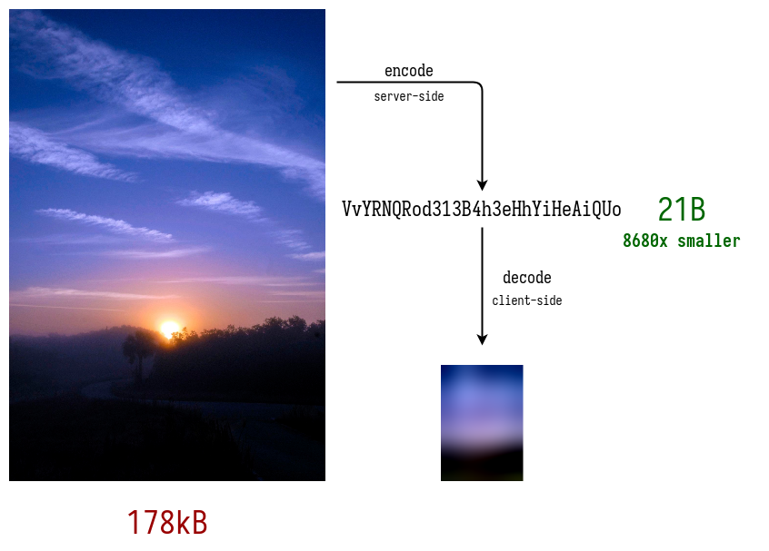

# go-thumbhash
## Introduction
The go-thumbhash library implements the
[Thumbhash](https://evanw.github.io/thumbhash/) image placeholder generation
algorithm invented by [Evan Wallace](https://madebyevan.com/).

This algorithm is used to calculate a small binary hash representing an image
using a [Discrete Cosine
Transform](https://en.wikipedia.org/wiki/Discrete_cosine_transform). The hash
can then be used to generate a lossy representation of the original image.

The main use case is progressive loading of a web page containing lots of
images, e.g. a photo gallery. Store the hash of each image in your database,
and send it in the HTML document. On the client side, use Javascript (e.g.
Evan Wallace's library) to generate a placeholder image from the hash. Then
load the original image asynchronously.

## Usage
Refer to the [Go package
documentation](https://pkg.go.dev/go.n16f.net/thumbhash) for information about
the API.

See the [`thumbhash` program](cmd/thumbhash/main.go) for a practical use case.

# Licensing
Go-thumbhash is open source software distributed under the
[ISC](https://opensource.org/licenses/ISC) license.
